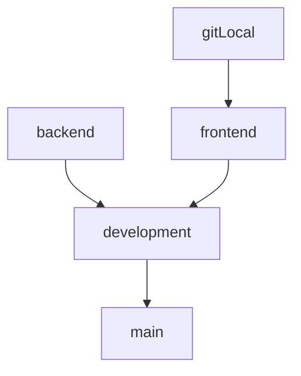

# Frontend Team

## The Graph demonstrates Git branchs



## First time

1. Clone repository

```
git clone https://github.com/tranvinh146/project-IE213
```

<br>

<<<<<<< HEAD
2. Switch to `frontend` branch

```
git checkout frontend
=======
2. Create and switch to `backend` branch

```
git checkout -b backend
>>>>>>> d4788ef50474ec8d0c0ae617faaf56e1dcc9d52b
```

<br>

3. Pull code from `backend` branch

```
git pull origin backend
```
<br>

4. Create your branch at git local

```
git checkout -b yourname
```

## In later times, to submit code

1. Commit your code at local _(be sure at `yourname` branch)_

   \* Note: `message` is formatted by "YourName - Action file.js" (e.g., "Vinh - Update index.js, Add server.js")

```
git add .
git commit -m "YourName - Action file.js"
```

<br>

2. Switch to `frontend` branch

```
git checkout frontend
```

<br>

3. Merge your code at `yourname` branch into `frontend` branch

```
git merge yourname
```

<br>

4. Pull code from `frontend` branch

```
git pull origin frontend
```

<br>

5. Push your code to `frontend` branch

```
git push origin frontend
```

<br>

6. Finally, back to `yourname` branch

```
git checkout yourname
```
