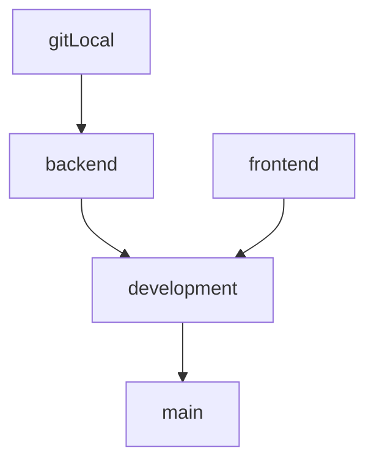

# Backend Team

## The Graph demonstrate Git branchs



## First time

- Clone repository

```
git clone https://github.com/tranvinh146/project-IE213
```

- Switch to `backend` branch

```
git checkout backend
```

- Create your branch at git local

```
git checkout -b yourname
```

## In later times, to submit code

- Commit code at local _(be sure at `yourname` branch)_

  \*Note: `message` is formatted by "YourName - Action file.js" (e.g., "Vinh - Update index.js, Add server.js")

```
git add .
git commit -m "YourName - Action file.js"
```

- Switch to `backend` branch

```
git checkout backend
```

- Merge your code at `yourname` branch into `backend` branch

```
git merge yourname
```

- Pull code from `backend` branch

```
git pull origin backend
```

- Push your code to `backend` branch

```
git push origin backend
```

- Finally, change to `yourname` branch

```
git checkout yourname
```
